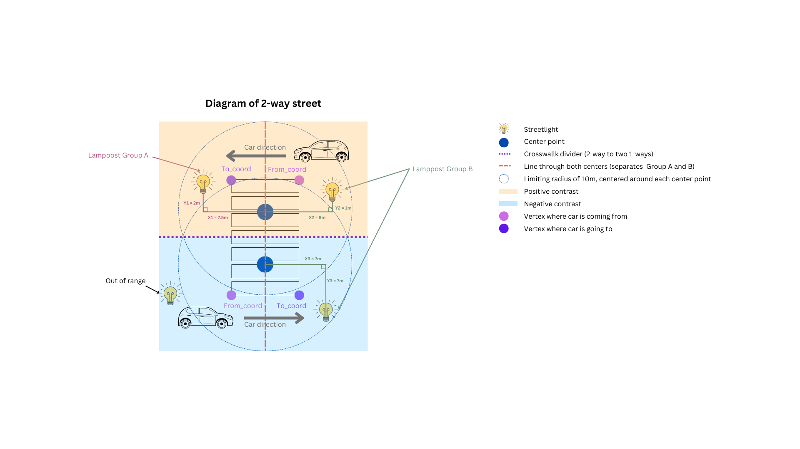

Crosswalk Brightness and Contrast Heuristic
===========================================

Overview
--------
This document outlines the process and algorithms used to compute contrast heuristic values for crosswalks. The calculation involves multiple steps, including data loading, crosswalk edge classification, center detection, vehicle direction analysis, and contrast computation.

Process Flow
------------

.. graphviz::
    :name: sphinx.ext.graphviz
    :caption: Data pipeline for crosswalk contrast and brightness heuristic
    :alt: Data pipeline for Crosswalk Contrast and Brightness Heuristic
    :align: center
    :layout: neato

    digraph "sphinx-ext-graphviz" {
        rankdir="LR";
        graph [fontname="Verdana", fontsize="12"];
        node [fontname="Verdana", fontsize="12", shape=box, style=rounded];

        load_data [label="Load GeoJSON data\n(crosswalks, streetlights, road segments)"];
        simplify [label="Simplify crosswalk geometry\nand decompose edges"];
        classify_edges [label="Classify edges\n(vehicle vs pedestrian)"];
        compute_centers [label="Compute crosswalk centers"];
        detect_direction [label="Detect vehicle direction at each center"];
        find_streetlights [label="Find streetlights near each center"];
        classify_sides [label="Classify streetlights by vehicle side\nand append distance info"];
        compute_heuristics [label="Compute brightness & contrast heuristics"];
        aggregate_results [label="Aggregate and store as table"];

        load_data -> simplify -> classify_edges -> compute_centers;
        compute_centers -> detect_direction -> find_streetlights;
        find_streetlights -> classify_sides -> compute_heuristics -> aggregate_results;
    }

Steps
-----

1. **Load Datasets to Database**:

- GeoJSON datasets for crosswalks, streetlights, and street segments are loaded into a DuckDB database.

2. **Classify Crosswalk Edges**:

- Crosswalk polygons are simplified to minimum bounding rectangles with exactly 4 edges.
- Edges are decomposed, assigned IDs, and classified as vehicle or pedestrian based on street segment intersection.
- A boolean ``is_oneway`` column is added to all segments based on the intersecting street segment’s attribute to distinguish one-way streets from two-ways.

3. **Find Crosswalk Centers**:

- One-way crosswalks receive a single center point, labeled 'A', located at the centroid of the intersection between the crosswalk and street segment.
- Two-way crosswalks are assigned two centers (A, B) calculated from interpolated midpoints between pedestrian edges and street segment intersections.

.. note::
    Direction of vehicles is critical in determining the contrast level of a pedestrian observed by the driver. Thus, we identify the direction assuming that the vehicle always drives on the right side of the road, except for one-way streets.

4. **Identify Vehicle Direction**:

- **One-way streets**: Use the street segment's marked one-way direction to determine vehicle direction.
- **Two-way streets**:
    - Case 1: If the crosswalk center’s X value is greater than the street center point’s X value, we assume the vehicle is moving from ``y_smaller`` to ``y_larger``.
        – For the ``from_coord``, choose the vertex of the pedestrian edge with the smaller Y value.
        – For the ``to_coord``, choose the vertex with the larger Y value.
    - Case 2: If the crosswalk center’s X is less than the street center point’s X value, we assume the reverse:
        – For ``from_coord``, choose the vertex with the larger Y.
        – For ``to_coord``, choose the vertex with the smaller Y.
    - Case 3: If the crosswalk center’s Y is greater than the street center point’s Y value, we assume the vehicle is moving from ``x_larger`` to ``x_smaller``.
        – For ``from_coord``, choose the vertex with the larger X value.
        – For ``to_coord``, choose the vertex with the smaller X value.
    - Case 4: If the crosswalk center’s Y is less than the street center point’s Y value, then:
        – For ``from_coord``, choose the vertex with the smaller X value.
        – For ``to_coord``, choose the vertex with the larger X value.

5. **Find Nearby Streetlights**:

- For each crosswalk center, streetlights within ~20 meters are collected using ``ST_DWithin_Spheroid`` and precise distance via ``ST_Distance_Sphere``.
- ``streetlight_id`` and ``streetlight_dist`` are stored as arrays indexed per crosswalk center.

6. **Classify Lights by Side**:

- Create a directional line ``a_to_b`` between center A and center B. In case of a way with only one center, the line is drawn from the center to the midpoint of a pedestrian edge as a synthetic center B.
- Create a vector ``from_to_to`` from ``from_coord`` to ``to_coord`` to mark the direction of traffic.
- Create lines ``center_to_light`` from the center to each streetlight.
- The cross product of the ``a_to_b`` vector and the ``from_to_to`` vector is calculated to determine the reference "from-to" direction.
- The cross product of the ``a_to_b`` vector and the ``center_to_light`` vector is calculated to determine the relative direction of the streetlight.
- If the signs of the two cross products match these lines, then the streetlights are labeled as on the ``to`` side, otherwise as on the ``from`` side.
- Each classified streetlight entry retains its distance and calculated angle to the crosswalk direction.

7. **Compute Brightness and Contrast Heuristics**:

- Two heuristics are computed:
    - **Contrast heuristic**: :math:`\sum \left( \frac{1}{{\text{distance}^2}} \right) * |\sin(angle)|`
    - **Brightness heuristic**: :math:`\sum \left( \frac{1}{{\text{distance}^2}} \right)`
- Results are grouped by center and stored in ``crosswalk_centers_contrast``.
- Classification Logic: (with input threshold value of 0.01)
    - If either side has a heuristic of 0:
        - If the difference is ≤ 0.005 -> ``no contrast``
        - If ≤ 0.0075 -> ``weak contrast``
        - Else -> ``strong contrast``
    - If both sides have heuristics:
        - ≤ 0.0075 -> ``no contrast``
        - ≤ 0.01 -> ``weak contrast``
        - Else -> ``strong contrast``

