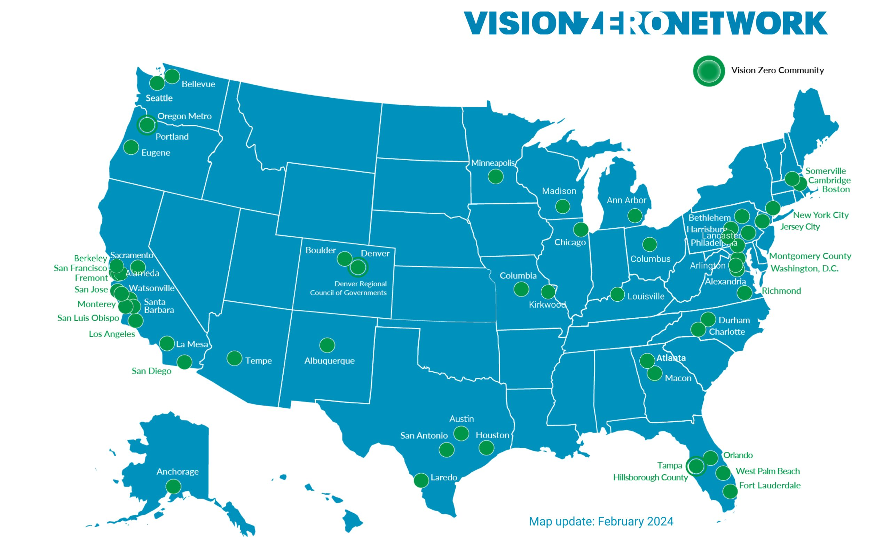

Dataset Choices
===============

Since creating a synthesized dataset based on multiple datasets is a critical part of the data processing pipeline, we have to make some choices regarding the datasets that we use. This document serves to explain the significant yet non-obvious logic and choices regarding different types of datasets.

Crosswalk Dataset
-----------------

The crosswalk dataset should contain polygons that represent the boundaries of the crosswalks. The dataset ideally should accurately reflect the real world, but there is an implicit understanding that the dataset may not be perfect since most cities do not have a comprehensive dataset of crosswalks. The dataset should be in a format that can be easily read by the software, such as GeoJSON. In the testing module, you'll find the tests for fetching the crosswalk dataset and mapping it for the city of Boston. We've chosen Boston for its relative ease of access to various datasets and physical proximity to the team at Olin College of Engineering.

UMass Amherst has been developing a dataset of all crosswalks in Massachusetts using computer vision model (YOLOv8) and aerial imagery. The dataset is not perfect, but it is a good starting point for our project, and has the potential to be applicable for states that also do not have a thorough catalog of their crosswalk assets. The dataset can be viewed at the `UMass Crosswalk Dataset <https://www.arcgis.com/apps/mapviewer/index.html?url=https://gis.massdot.state.ma.us/arcgis/rest/services/Assets/Crosswalk_Poly/FeatureServer/0&source=sd>`_.

Traffic Dataset
---------------

Since our project is focused on pedestrian safety at nighttime on crosswalks, we need a dataset that contains information about the volume of traffic. MassDOT provides a convenient dataset that includes average annual daily traffic (AADT) counts for most roads in Massachusetts. The counts will be used to inform the risk of a pedestrian being hit by a car at a given crosswalk. The dataset can be viewed at the `MassDOT Traffic Dataset <https://www.arcgis.com/apps/mapviewer/index.html?url=https://gis.massdot.state.ma.us/arcgis/rest/services/Roads/VMT/FeatureServer/10&source=sd>`_.

Population Density Dataset
--------------------------

The population density data is sourced from the American Community Survey (ACS) 5-year estimates, which provide reliable demographic information on U.S. populations. The ACS data is integrated with geographic data from census tract boundaries to compute the area of each tract and derive population density values.

Density Calculation Methodology
^^^^^^^^^^^^^^^^^^^^^^^^^^^^^^^

1. **Geographic Area Calculation**:
   Each census tract is represented by a polygon geometry, and its area is calculated in square kilometers. To ensure accuracy, geometries are reprojected to a projected coordinate system (EPSG:3857) before calculating areas.

2. **Population Segments**:
   The dataset includes specific population segments based on age and disability
   status:

   - **Total Population**: Total number of individuals residing within each tract.
   - **Senior Population (65+)**: The population aged 65 years and older.
   - **Youth Population (0-17)**: The population aged 17 years and younger.
   - **Disabled Population**: Individuals identified as having a disability.

3. **Density Calculation**:
   Population density for each segment is calculated by dividing the total
   population or segment-specific population by the area of each tract in
   square kilometers. This results in values representing the density of each
   population segment (e.g., seniors per km²).

Streetlights Dataset
********************

The main information that the streetlights dataset should contain is the location of the streetlights. Additional information such as the type of bulb, last-replacement year, and wattage, etc. are useful to have as well. After talking to Michael Donaghy, Superintendent of Street Lighting at the City of Boston Public Works Department, we learned that Boston has recently completed a full catalog of their streetlight assets in 2023. We acknowledge that many cities might not have this data available, in which case, `OpenStreetMap features <https://wiki.openstreetmap.org/wiki/Tag:highway%3Dstreet_lamp>`_ could be used to roughly estimate the streetlight locations. The Boston streetlight dataset can be viewed at the `Boston Streetlight Dataset <https://sdmaps.maps.arcgis.com/apps/dashboards/84e1553e754b424f9c544ab5079ed99f>`_.

Income Dataset
**************

The income dataset is also sourced from the American Community Survey (ACS) 5-year estimates. The dataset includes median household income data for each census tract within a specified state and year. The data is used to analyze the relationship between income levels and pedestrian safety, as well as to identify areas with possible infrastructure inequity.

Past Accidents Vision Zero Dataset
**********************************

We have chosen to use the pedestrian accidents dataset from the Vision Zero initiative in Boston. The dataset contains information about the location of accidents, the date and time of accident, and the severity of the accident (injury/fatality). The dataset is used to identify high-risk areas for pedestrian accidents and to inform the prioritization of crosswalks for safety improvements. The dataset can be viewed at the `Vision Zero Dataset <https://experience.arcgis.com/experience/bae68e65908f45e1bcc86fe5f089d266/page/>`_.

    Vision Zero Network Community Map (February 2024)

Vision Zero initiatives are a nationwide effort to eliminate traffic fatalities and severe injuries. Growing number of cities have contributed to this effort and collected data, which will help this project be applicable outside of Boston as well.

Pedestrian Generators
*********************

Pedestrian generators are establishments and attractions that will draw a flow of people. We focused on making catogories that target light night foot traphic and higher risk populations. To collect the data we used Open Street Map, which has a lot of crowd sourced data. The data is not a complete set, but is a good starting place to look at this attribute. The following are the catogories that we looked for:

   - **Tourist Spots**: Tourism areas, museams, art galleries, attractions, viewpoints, zoo, theme parks, memorials, monument, historic sites
   - **Schools**: Schools, university, college, language schools
   - **Health Facalities**: Hospitals, clinics, nursing homes, doctors, dentists, pharamcies, disability services, social facilities, healthcare
   - **Open Spaces**: Parks, nauares reserve, gardens, recreation grounds, playgrounds, grass
   - **Shopping**: Shops, markets, supermarkets, convenience stores, department stores, clothe stores, shoe stores
   - **Night Life**: Bars, Pubs, Nightclubs, casinos, cocktail bars, beer gardens, dance centre, drinking water
   - **Open Spaces**: Parks, nauares reserve, gardens, recreation grounds, playgrounds, grass
   - **Restaurants**: Restaurants, fast food, food court, ice cream, pizza

Here is more information on each of the tags on the `OSM Website <https://wiki.openstreetmap.org/wiki/Map_features>`.
